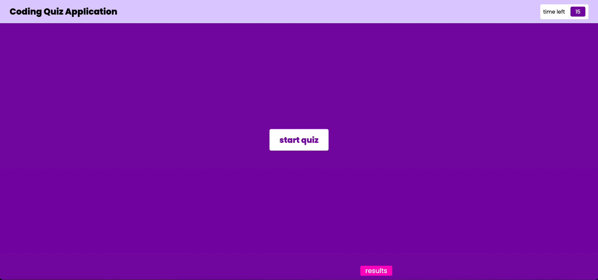
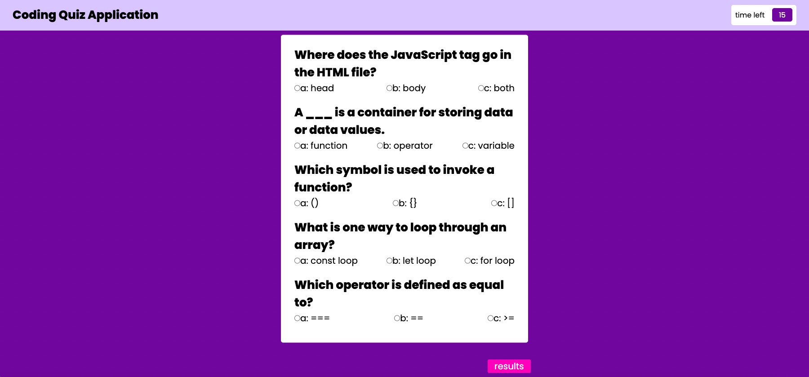
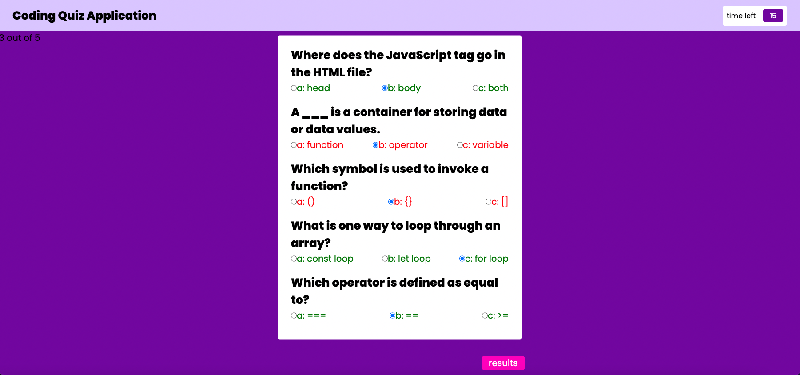

# Coding Quiz Application

## Description

As an even numbered week challenge, my task is to create a coding quiz application to meet the acceptance criteria. I used HTML, CSS, and JavaScript to achieve this functionality.

The coding quiz application should have the ability to start by clicking a button, which starts a timer and presents a single question. Once the question has been answered, a prompt for correct or wrong should display at the bottom. The user should then be prompted to the next question and so on until the desired number of questions has been answered. An incorrect response should deduct time from the timer. The quiz is over when all the questions have been answered or when the timer gets to 0. The user should have the option to add their initials and save their score at the end.

This assignment was a challenge, and my application is not fully developed. I will continue working on the buttons, timer, and displaying quiz questions one by one. I am reading through documentation and will begin utilizing early office hours more to strengthen my knowledge in this area.

## Link to Deployed Application

